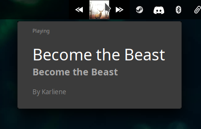

# Slotify

genmon script/s for XFCE to control and display spotify and cover art

This is currently set to work best for a bar **40 pixels high** due to the SVG icons and album art script.

Use the spotify-prev.sh (optional), spotify-play.sh, and spotify-next.sh (optional) scripts as your genmon scripts.
Set timer to about 1 second without a title.
